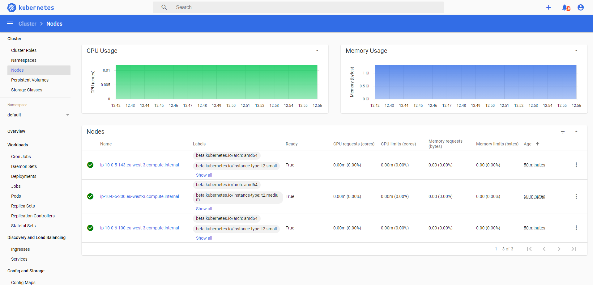
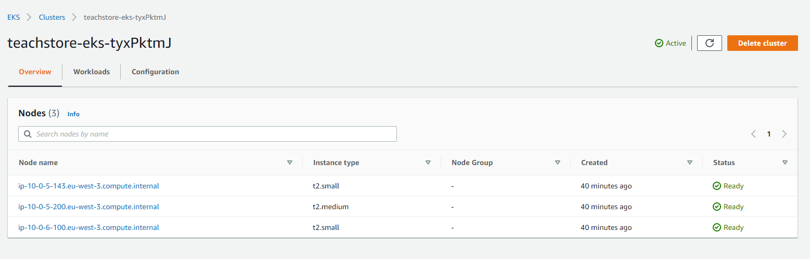
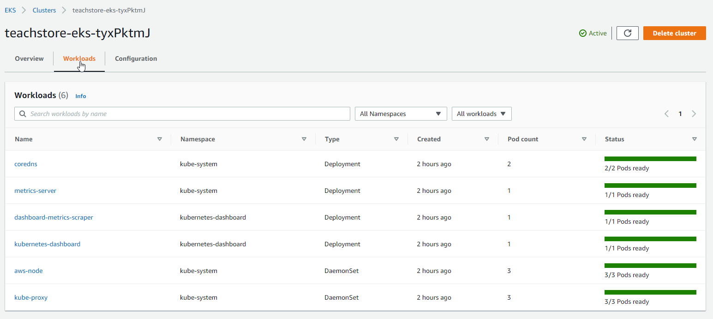

# IaC - Infrastructure on AWS
## Terraform & Ansible & EKS



---
## *Before start...* Prerequisites
- AWS CLI - Installed & Configured
- AWS IAM Authenticator - Installed
  - https://docs.aws.amazon.com/eks/latest/userguide/install-aws-iam-authenticator.html
- kubectl
- wget
- eksctl (needed if you're going to install the AWS Load Balancer Controller in EKS)
---

## 1) Terraform 
Here, we create and manage all the infrastructure resources in AWS: 
- **Networking** 
  - VPC
  - Subnets
  - Route Tables
  - Internet Gateway
  - NATGateways
  - Elastic IPs
- **Compute**
  - EC2s
  - Security Groups
  - Auto Scaling Groups
  - Launch Configurations
- **Containers**
  - EKS Cluster

### 1.1) First...  the Genesis, *only once!*
First prepare the terraform state environment, **this step should be ran only once**. It will create and prepare all AWS required Services (S3, DynamoDB), necessary to store, share and the locking management of the Terraform state environment created.
```bash
$ cd genesis
$ export TF_VAR_environment=dev
$ make init
$ make apply
```
### 1.2) Start Terraform Infrastructure Environment
Here we start to create the environment itself, for the AWS EKS. This process can be (re)executed anytime and as many times as we need, (re)creating/updating all the environment infrastructure.

1.2.1) Choose the environment (dev) and create the State (donwload modules, plugins, etc.).
```bash
#### Inside the main directory (project root)
$ cd dev
$ export TF_VAR_environment=dev   # Sets the environment variable for Terraform scripts
$ make init
```
1.2.2) Create the Plan (to check first what it's gonna be created)
```bash
$ make plan
```
1.2.3) Create the Environment
```bash
$ make apply
```
1.2.3) Point you kubectl to your AWS EKS Kubernetes (kubeconfig creation)

This is important, otherwise your kubectl commands will not work(point to) over your EKS.
```bash
$ make kubectl-config-aws
```

---

## 2) Ansible

Here, the Ansible's playbook is built to trigger commands against EKS (works locally, but could be from anywhere). That's why it is important to check which Kubernetes (API Server) your kubectl is going to direct the commands *(the makefile is prepared to configure your local kubectl to point to the new EKS Cluster)*.

```bash
# My Kubernetes Clusters
$ kubectl config get-clusters
NAME
arn:aws:eks:eu-west-3:411078575449:cluster/teachstore-eks-SiALeNT2
kind-k8s3nodes
minikube

# Which one I am pointing to...
$ kubectl config get-contexts
CURRENT   NAME                                                                 CLUSTER                                                              AUTHINFO                                                             NAMESPACE
          arn:aws:eks:eu-west-3:411078575449:cluster/teachstore-eks-P7wVN7yl   arn:aws:eks:eu-west-3:411078575449:cluster/teachstore-eks-P7wVN7yl   arn:aws:eks:eu-west-3:411078575449:cluster/teachstore-eks-P7wVN7yl
*         arn:aws:eks:eu-west-3:411078575449:cluster/teachstore-eks-SiALeNT2   arn:aws:eks:eu-west-3:411078575449:cluster/teachstore-eks-SiALeNT2   arn:aws:eks:eu-west-3:411078575449:cluster/teachstore-eks-SiALeNT2
          kind-k8s3nodes                                                       kind-k8s3nodes                                                       kind-k8s3nodes
          minikube                                                             minikube                                                             minikube
```

2.1) Playbook: **k8s-basic-software-playbook.yaml**

In this Ansible playbook, we perform some basic software configuration in our AWS environment:
- **Metrics Server** 
  - Download and install Metrics Server on Kubernetes (EKS)
- **Dashboard**
  - Download and install Kubernetes Dashboard

2.1.1) Install Metrics Server and Dashboard on AWS EKS
```bash
$ make ansible_basic_soft
```
2.1.2) Show EKS K8s info, when you need to recover it
```bash
$ make ansible_k8sinfo
```
2.1.3) Access Dashboard using kubectl proxy via API Server
```bash
#### Let it open (shell session)
$ kubectl proxy 
#### Open in Browser
http://localhost:8001/api/v1/namespaces/kubernetes-dashboard/services/https:kubernetes-dashboard:/proxy/#/overview?namespace=default
#### Use token from "make ansible_k8sinfo" for authorization
```

---

#### Check whatelse you can do:
```bash
$ make help
```