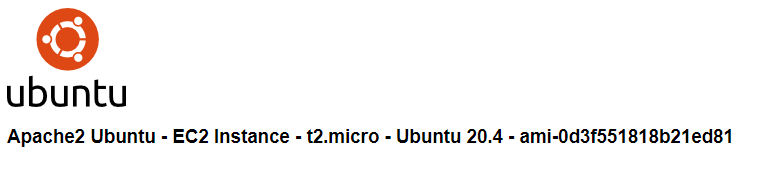

# IaC - Infrastructure on AWS
## Apache Server (Private / Public)

Create a Apache Server in a Private or Public Subnet.



Creating a Public Apache Server
```bash
variable private_server {
    type    = bool
    default = false
}
```

Creating a Private Apache Server
```bash
variable private_server {
    type    = bool
    default = true
}
